# Ejercicio 4 - Informe de evidencias del proyecto
## 4.1. Introducción
La web está tematizada en la saga the legend of zelda, donde incluyo
 7 curiosidades sobre ella. Cada una de estas curiosidades las he puesto junto a una foto y una descripción. 
 Luego una galería donde he puesto imágenes varias de la web y les he puesto un
 título. He incluido una tabla comparativa de los juegos de zelda, junto su fecha
 de salida, plataforma, precio de salida aproximado y una valoración calidad-precio.
 He includio un formulario, donde pido un registro de la persona, su opinión de la web
 y si quiere suscribirse al boletín y por último las redes sociales y email de contacto.
 La idea inicial con la web era darle una ambientación a pergamino antiguo, con cierto
 aire a naturaleza, como una reliquia encontrada en el campo.  
 ## 4.2. Evidencias de HTML5
 ### Header 
 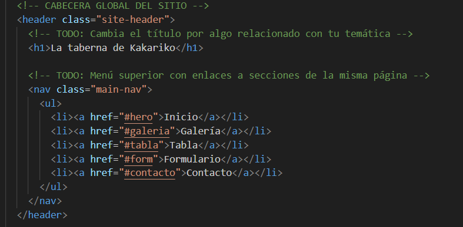  
 El header lo usamos para indicar la cabecera de la web, lo que irá "arriba del todo" o primero.
 ### Main
 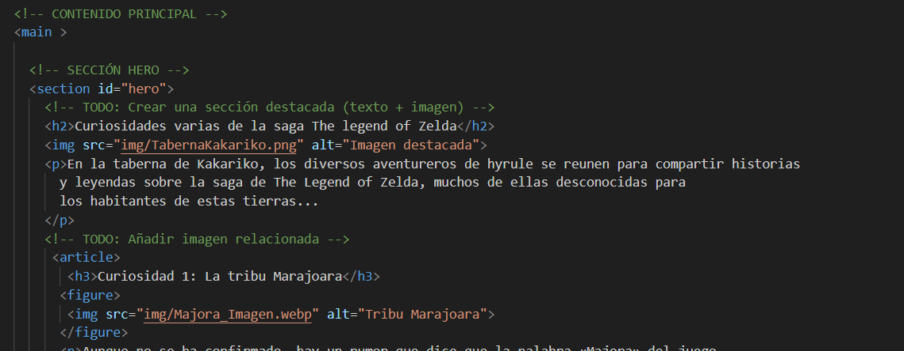  
 El main indicará el contenido principal de la web.
 ### Section 
 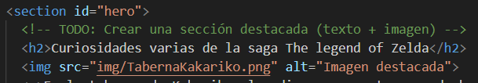  
 Section sirve para separar los contenidos de dentro de la web.  
 ### Footer 
 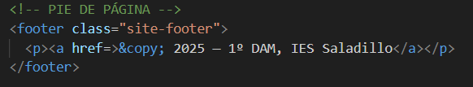  
 El footer sirve para indicar el pie de página.  
 ### Menú superior
 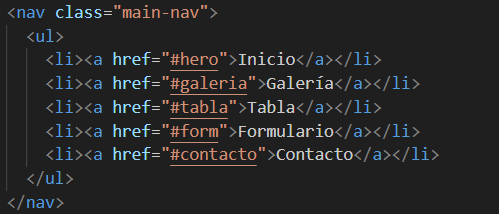  
 El menú superior nos servirá para ir directamente a la parte de la web que deseemos de forma directa.  
 ### Menú lateral 
 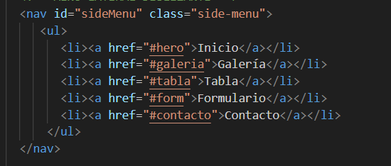  
 El menú lateral tiene la misma función que el superior, pero puedes acceder a él en cualquier momento, mientras
 que el superior se puede quedar arriba y sin movimiento.
 ### La sección Hero
 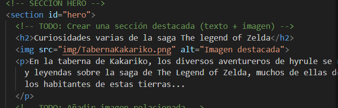  
 La sección hero nos sirve para hacer una sección destacada, una "portada a la web".
 ### La tabla 
 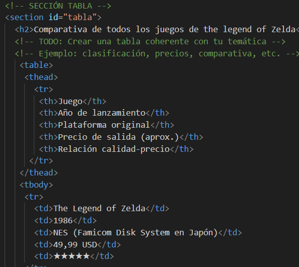  
 La tabla nos sirve para organizar la información, y entoces podríamos hacer comparativas, una clasificación,etc.
 ### El formulario
 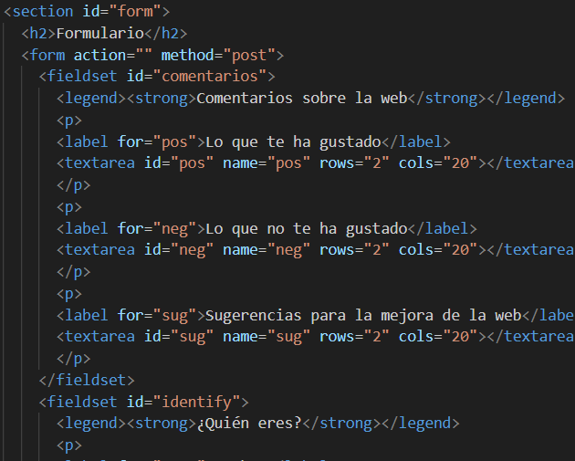  
 El formulario nos sirve para pedir datos al usuario, opiniones,etc. En resumen, registrar información del usuario.
 ### La galería de imágenes 
 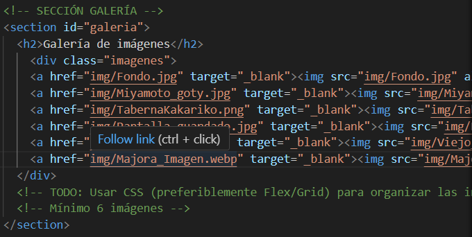  
 La galería nos sirve para exponer fotos de forma organizada, ya sean de las propias usadas en la página web u otras.
 ### Enlaces internos y externos  
 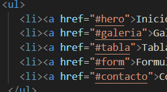  
 Los enlaces internos nos servirían para acceder a contenidos dentro de los archivos de la web y los externos para webs y recursos de fuera de la web.

 ## 4.3. Evidencias de CSS 
 ### Selectores
 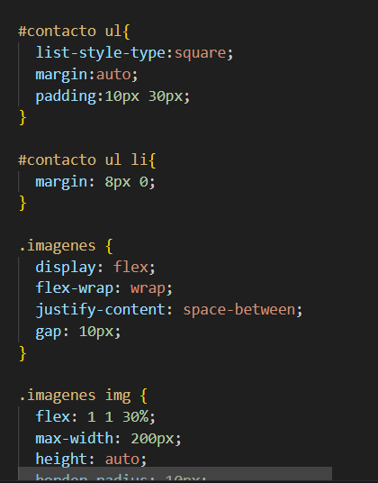  
 El objetivo de por ejemplo #contacto ul, es modificar el estilo del ul dentro del section con id contacto, lo mismo pasa con #contacto ul li, quiero modificar en la lista los apartados li, dentro de ul, que está dentro de #contacto. Luego con .imagenes es llamar a clase del div, el espacio donde están las imágenes y luego .imagenes img para modificar las propias imagenes.
 ### Pseudoclases
 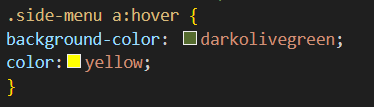  
 Con pseudoclases como :hover he intentado que, cuando el ratón pase por encima de los elementos del menú lateral, se coloree el fondo, y si hubiera cambiado el color a otro que no sea amarillo, se hubiera cambiado también al pasarlo por encima.
### Flexbox 
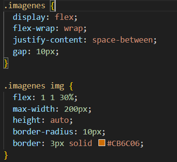  
Lo que intento hacer con esta configuración es que cuando las imágenes se queden sin sitio salten a la siguiente línea, que dejen el mismo espacio entre ellas.  
### Uso de sombras(box-shadow)
  
Lo que intento hacer con box-shadow, es con los dos primeros números posicionar la sombra respecto a la imagen, con el tercero difuminar la sombra y con el último darle espesor, lo último es el rgb del color de la sombra.
### Estilos de menús 
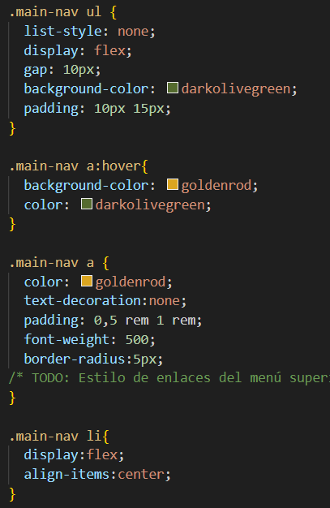  
La primera parte me sirve para darle fondo al menú, el :hover para que cuando pase por encima cambie de colores y el .main-nav a para decidir el color base, quitarle la línea por debajo de enlace, el tamaño de las letras y el padding entre enlaces del menú.  
## 4.4. Fuentes utilizadas  
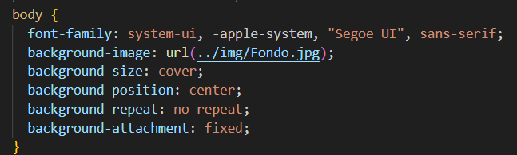  
He dejado la fuente que dejó como base, no se me ha ocurrido cambiarlo ni darle otra distinta a otras partes de la web, no se me ha ocurrido.
## 4.5. Menú lateral: breve explicación  
Al pulsar el botón de menú lateral se abre y muestra las opciones del menú. La clase que cambia es toggleBtn, que si haces click cambia el contenido del texto, la hamburguesa o una x.  
### Como se mueve el menú con css
En el css tenemos primero el .open-menu, con position, top y left se ancla a la esquina superior, con z-index el botón se queda por encima del menú y luego con transition ponemos las animaciones. En .open-menu.active tenemos transform:rotate, para que cuando clickemos se gire 90 grados. Luego con .side-menu, tenemos la position,top y left, pero con left le ponemos px en negativo para que se quede fuera de pantalla hasta que clickemos y con z-index se situa por debajo del botón. Y por último, con left, le decimos que cuando activemos el menú se mueva hasta 0px, a la vista.  
## Conclusión personal  
He aprendido a manejarme mejor a la hora de poner fondos, padding, margenes, sombras, efectos y bordes, además de la propia posición de la página web, puesto que he tenido que ir probando hasta que me ha convencido el resultado. Me gustaría mejorar apartados como los colores, el menú lateral, el menú principal, la galería y la disposición de los padding en la web sobre todos para el título de las curiosidades. Lo que más me ha costado es el flexbox, sin duda alguna, puesto que he ido probando hasta que me ha gustado como ha quedado. Y lo que me gusta más de mi página web es el fondo, me he buscado un fondo bonito con la naturaleza, los árboles, el cielo y de fondo(aunque no se vea) el castillo.